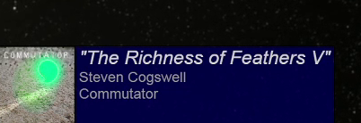

 # README

 OSX shell script to get currently playing iTunes track information and write it to a file for an OBS overlay. 

# Screenshot 

# Caveat

 This relies on osascript so likely isn't useful on systems other than OSX. I wrote this for myself for my streaming setup so it probably doesn't work out of the box the right way for you.  I use iTunes playing on a Mac from a local library (not Apple Music), and the actual streaming machine running OBS Studio is Windows 7. Files are transferred via a directory shared on the streaming computer and mounted on OSX. As they say "your mileage may vary."

 I wrote and run this under OSX 10.13.6 (High Sierra) to work without external dependencies or requiring other software packages installed other than the default OSX installation.  All the code is in one file for completeness, with the only other required files being a css and a default artwork image for when there's no album art.  

# Usage
After editing the script to match your setup, in an OSX terminal window, invoke the script with ``./iTunesNowPlaying.sh``

 Edit ``outputDir`` to say where your OBS browser source files will go. Do not use the same directory as the script directory. This works across a mounted network share as long as the remote directory is already mounted, which is how I use it.  

 Needs a file called ``noart.jpg`` to use when no album art is present.  Otherwise it will try to use album art (``.png`` or ``.jpg``) associated with the playing track.

 The script will copy the file ``nowplaying.css`` to the target directory to use as a stylesheet.  Use ``nowplaying.css`` to customize your colours and styles and layout of the browser source box. 
 
 Edit the local ``nowplaying.css`` as the remote one will get overwritten.  

 The script tries to write a file only when the track changes to cut down on file writing traffic. 

 The written HTML file uses a ``meta refresh`` to make OBS reload the file as the file changes in the background.  When it writes a file with no information it still makes a minimal HTML file with a ``meta refresh`` so OBS will (hopefully) continue to check the file if it changes.  You may have to manually refresh the source in OBS in cases where this breaks down. 

 To use in OBS, use a Browser Source pointing to the local file ``nowplaying.htm`` in the ``outputDir`` directory. 

 By default I make it work with an 800x130 OBS browser source size box.  The album art is scaled via the html file to 128px for display.  The artwork files themselves are not resized so you can probably use sizes other than 128px just by editing the css/html parts. 

 Use ``ctrl-c`` to stop the script, and it will clean up the browser source on exit. It will drop a minimal html file with a meta refresh still active so if you start the script up again you don't have to refresh the browser manuall in OBS.   

Thanks to http://hints.macworld.com/article.php?story=20011108211802830 for how to use osascript with iTunes, and https://stackoverflow.com/questions/16995273/getting-artwork-from-current-track-in-applescript for how to get the playing artwork via osascript.  